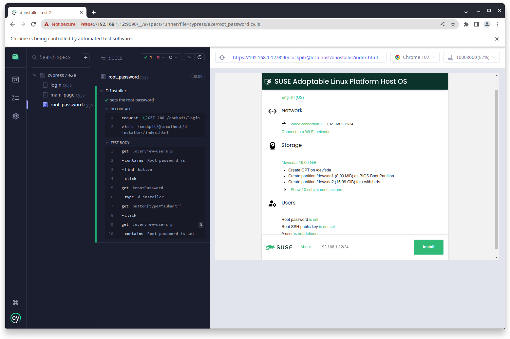

# Experimental End-to-End Tests for the D-Installer

This is a testing repository with integrations tests for the
[D-Installer](https://github.com/yast/d-installer) project.



## Cypress

These tests use the [Cypress](https://www.cypress.io/) testing framework.

## Installation

Checkout this repository and run this command in it:

```shell
npm install
```

This will install the NPM packages into the `node_modules` subdirectory
and download the Cypress framework into the `~/.cache/Cypress` directory.

*Note: The uncompressed Cypress needs about 0.5GB, make sure you have enough
space in your $HOME directory.*

## Editing the Tests

- `cypress.config.js` - Cypress configuration, see [documentation](
  https://docs.cypress.io/guides/references/configuration) for more details
- `cypress/support/e2e.js` - the main file loaded before all tests
- `cypress/support/commands.js` - extends the Cypress functionality,
  define helper methods (loaded from `e2e.js`)
- `cypress/e2e/\*.cy.js` - individual test files

## Running the Tests

### Setting the Target

This project defines the default URL as `https://localhost:9090` which
expects the D-Installer is running locally. If you want to run the test against
an instance which is running elsewhere use set the `CYPRESS_BASE_URL` environment
variable.

```
CYPRESS_BASE_URL=https://192.168.1.12:9090
```

### Interactive Session

You can run the tests interactively using a GUI frontend:

```
npx cypress open
```

Just click a test file to run it. Cypress watches the tests and re-runs them
if they are modified.

### Command Line Session

Or you can run the tests from command line. To run all tests using the embedded
Electron browser:

```
npx cypress run
```

To use a specific browser from the current system:

```
npx cypress run --browser chrome
```

You can list the available browsers with:

```
npx cypress info
```

To run just a specific test:

```
npx cypress run --browser chrome --spec cypress/e2e/login.cy.js
```

The tests are by default run in headless mode, if want to see the actions
in a browser use the `--headed` option.

## Cypress Documentation

- https://docs.cypress.io/
- https://www.youtube.com/watch?v=5XQOK0v_YRE
- https://github.com/cypress-io/cypress-realworld-app
- https://github.com/cypress-io/cypress-example-recipes